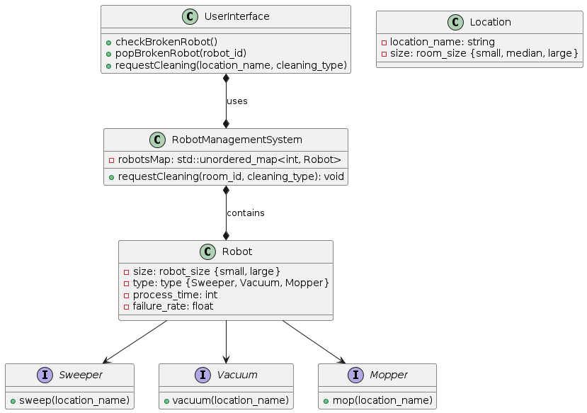
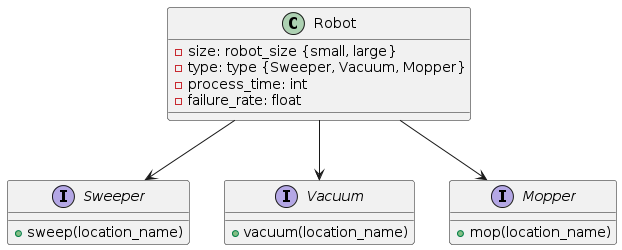
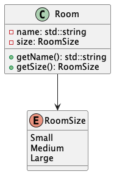

# Class Diagrams

The following diagrams demonstrate the individual classes our software will be made up of, and the connections between them.

## Class Diagram Overview
This will serve as our master file for the connections between all the classes that will make up our system. It will be updated as we continue to get more detailed in our designs. 

## Robot Class
There will be a parent class of **Robot** which will represent a general robot. There can be only two sizes of robots, *small* or *large*, each of which can be either a *sweeper*, *vacuum*, or *mopping* robot. Each of the robot types can only complete its matching task, i.e. a sweeper robot can only sweep but not vacuum or mop. Robots of small size can only clean small size rooms due to their battery capacity. Because of this distinction, the robot's actions are interfaces that will be implemented differently based on the robot's size. Moreover, we use *process_time* to track a robot's availability: if it is 0, meaning it is available; otherwise, it is either broken or active. We use *fail_rate* to simulate fault scenarios.

## Location Class
There are three sizes of locations in the building - *small*, *medium*, and *large*. The size of the location is important because large robots can clean any size location, but small robots can only clean small locations.

