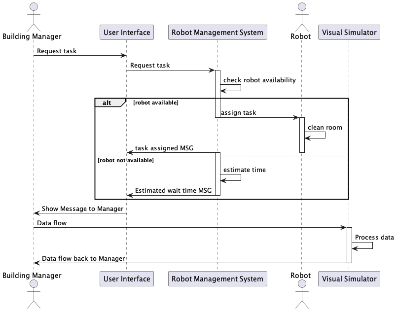

# Sequence Diagrams

The following diagrams demonstrate the interactions between actors and components of our software. These are used for planning, prior to any coding, and may be updated as we progress.

There are two main actors who will be interacting with our system: the **building manager** and **maintenance**. These actors will only be in direct contact with our user interface or command line, which will then communicate with the Robot Management System (RMS) to manage the interactions with the robot i.e. querying data and assigning tasks. 

## **Building Manager**
### **Request a Cleaning**
The building manager (BM) will be able to request a cleaning of a specific type (sweeping, vacuuming, mopping) for a specific room in their building. The BM will be in direct contact with the User Interface of our system, which will then communicate with the Robot Management System (RMS) in order to pass information between the customer and the robot. From the BM's perspective, they will simply request the task and be returned a message that will either specify that the task was succesfullly assigned, or be given a wait time for the next available robot.

The RMS will be responsible for checking for robot availability, which will require multiple checks:
+ Determine the size of the room requested
    + Find only large robots if room is medium or large
    + Prioritize small robots for small room request, but large robots are okay if small not available
+ Check only the robots which can perform the task request (sweep, vacuum, or mop)
+ Check the status of robots - only *idle* robots can be assigned a new task

Estimating the time for the next robot will also require a bit of processing with the RMS:
+ Determine the size of the room and choose the most suitable robot size
+ Check only the robots which can perform the task request (sweep, vacuum, or mop)
+ Choose the robot which has the shortest time until it is finished cleaning and return this number

## **Maintenance**
### **Check for Broken Robots**
The maintenance team will be able to check the status of all the robots in order to pick up broken ones to be fixed. As with the BM, maintenance will only interact with the UI which will communicate with the RMS. When requesting robot information, the maintenance team will be given a map of all the broken robots. After fixing one robot, they should return to the program to submit the fixed robot's ID number to notify the system that it is working again.

