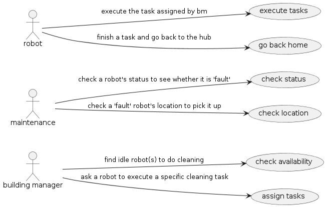
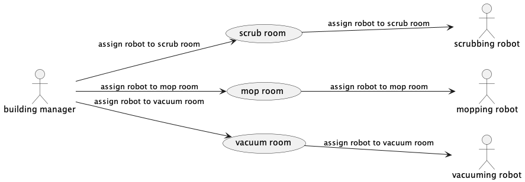
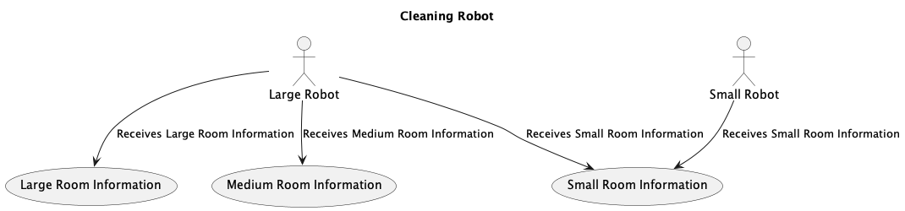

# Use Cases

The following use case diagrams describe the function of three actors within our cleaning robot fleet management system: the **building manager**, **maintenance**, and the **robots**. 

The **building manager** is responsible for managing where the robots clean and when, so their main desire is to be able to assign robots tasks based on their availability. The software should manage the robots' availability so that the building manager can easily assign tasks without having to worry about querying individual robots.

The **maintenance** team is responsible for fixing broken robots, so their main desire is to be able to check a robot's status (active, idle, or fault) and check its location to then retrieve and fix it.

The **robots** of course are the entities that the program is managing, but have their own requirements for interacting with the software. The robots should be able to recieve all the proper information (location) from the building manager to properly complete what is asked of them.

## The Diagrams
The following diagram captures the high level scope and function of the three actors.

This diagram captures a more detailed breakdown of the interactions **building manager** can have with the system. They are able to assign the three types of cleaning robots, scrubbing, mopping, and vacuuming, to complete their tasks. 

This next diagram captures the three types of **robots** -- small and large -- and their individual use cases based on three room sizes, small, medium, and large. 

## Team Contribution
* Tony:
    - Discussion on user stories and key features
    - Probability of Failure Simulation
    - Creating and assigning the cards
    - User Story 3 detailed PlaintUML
* Jenna:
    - Contributed to discussion on user stories and updated documentation files for the use case diagrams.
* Yili:
    - Discussion on user stories and key features
    - Scheduled meetings for brainstorm and organized meeting notes
    - Designed the general UML Diagram
    - Contributed to creating the user stories 
* Thando:
    - Contributed to main discussion of user stories
    - Designed the UML diagram for task assigning by the building manager
    - Contributed to meeting notes based on requirements elaborated in class discussions.