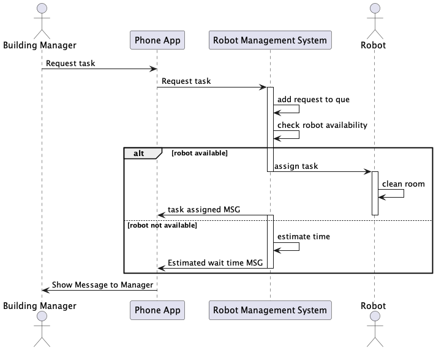

# Undergraduate Projects

## Projects Overview
+ Enhancing Visual Performance on Dancing Robots with OAK-D PRO
+ Exploration of Urban Blight and Property Values via Deep Learning
+ Stock Price Forecasting via Machine Learning
+ Cleaning Robot Management System
+ Image and Speech Processing using Chatgpt-api
+ Cyber Security Analysis on APT threat
+ Investigating Predator-Prey Model
+ Traffic Intersection Simulation
+ Snake Game Design with Self-Contructed CPU and Assembler
+ Target Shooting Strategy in Stock Market

## Enhancing Visual Performance on Dancing Robots with OAK-D PRO
+ Conducted research on OAK-D PRO depth camera to enhance the vision performance on dancing robot 
+ Contructed pipeline using DepthAI’s API in OAK-D PRO camera
+ Used openCV to analyze frames detected in the OAK camera and achieve feature tracking and stereo depth estimation
+ Utilized Flood IR LED illumination to enable perception in low-light and no-light environments, and implemented Laser dot projector to enhance passive depth perception for low-visual-interest surfaces.
+ Utilized openVINO to embed custom model and YOLO model into OAK camera by converting from pytorch form into blob form
+ Implemented non-maximum suppression and skeleton plotting
+ Embedding YOLOv7 and YOLOv8 model into OAK camera to achieve lower latency object detection and human pose estimation
+ Link to the Demo: https://youtube.com/shorts/J5G7IG2wvps 

## Exploration of Urban Blight and Property Values via Deep Learning
+ Conducted research on the influence of house appearance on housing prices using Google Street View photos and pixel-based scoring.
+ Employed advanced techniques, including Transfer Learning with VGG16 and AlexNet, for predictive classification of satellite images.
+ Utilized R studio's Spatial Data capabilities to establish spatial links between residents and their respective neighborhoods.
+ Applied hedonic model incorporating property attributes along with seasonality fixed effects to accurately estimate property value.

## Integrated Opinion Leader Sentiment Forecasting for Top Technology Company Stock Prices
+ Extracted stock market price data for renowned technology companies fromYahoo Finance. 
+ Leveraged Twitter's API to extract expert analysis comments on individual stocks, processed irrelevant information, and extracted factors. 
+ Conducted regression analysis using Linear Regression, Gamma Regression, Neural Network, and LSTM. 
+ Performed movement classification analysis using Logistic Regression, Support Vector Machine, and K-Nearest Neighbors. 
+ Demonstrate performance of each model by Utilizing Matplotlib and performance matrix

## Cleaning Robot Management System
+ MULTI-THREADED TASK MANAGEMENT: We implemented task assignment with multi- threading in C++, enabling scheduling of cleaning operations, charging, and maintenance tasks for robots.
+ CLI DEVELOPMENT:We created a C++ CLI for efficient user interaction and operational control of a large-scale cleaning robot fleet.
+ DEVELOPMENT TOOLS PROFICIENCY: We showcased expertise in Git and CMake for code version control and build management, highlighting a commitment to software engineering best practices.

## Image and Speech Processing using Chatgpt-api
+ Utilized ChatGPT-API and DALL-E3 to analyze the input image and output it with different style. 
+ Provided audio description to the output image with different voices by using Google-API.

## Cyber Security Analysis on APT threat
+ Conducted research in artificial intelligence and cyber security, topics including intrusion detection and deep neural network architectures. 
+ Proposed an intelligent threat detection method based on the extended Cyber Attack Chain model and the Long Short-Term Memory network autoencoder to extensively correlate malicious behaviors from spatial and temporal dimensions.
+ Publication: A spatial-temporal correlation-based method for advanced persistent threat detection, 2021 4th International Conference on Mechatronics and Computer Technology Engineering (MCTE), Nov 2021
+ Link to the publication: https://iopscience.iop.org/article/10.1088/1742-6596/2113/1/012037/meta

## Investigating Predator-Prey Model
+ Implemented logistics model of predator-prey dynamics using Runge-Kutta methods. 
+ Conducted parameters analysis using bifurcations and phase plane to identify dynamic relationships between predator and prey.

## Traffic Intersection Simulation
+ C++ Traffic Intersection Simulation Developed a modular C++ simulation for traffic intersections, emphasizing precision through object-oriented design.
+ Code Quality Focus Ensured high code quality with thorough testing, and utilization of advanced features like copy/move constructors.
+ Realistic Behavior Modeling Implemented accurate vehicle movement and intersection behavior, incorporating random number generation for realistic vehicle arrival and turning probabilities.
+ Link to the Demo: https://youtu.be/y5cMC-loJAQ

## Snake Game Design with Self-Contructed CPU and Assembler
+ Build a CPU using Logisim, and build an assembler using C++
+ Design and implement Snake Game using assembly 

## Target Shooting Strategy in Stock Market
+ Researched and analyzed limit-up/limit-down behavior's impact on stock market returns, employing quantitative analysis techniques. 
+ Conducted statistical analysis and generated visualizations for cumulative returns across various time frames and five limit patterns. 
+ Calculated the confidence interval for the factors derived from the analysis and validated accuracy through rigorous backtesting data. 
+ Developed optimized investment strategy based on key factors, including limit pattern and days after reaching limits.

